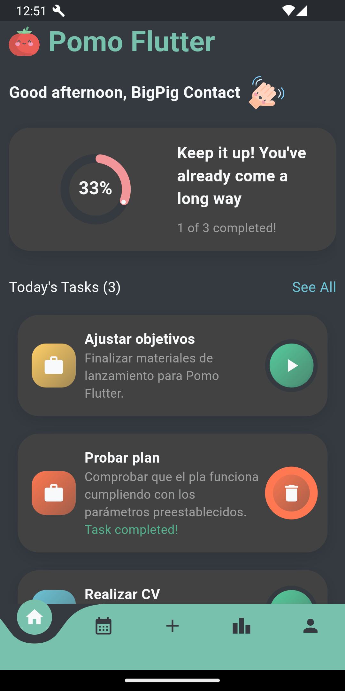

# PomoFlutter

Aplicación web/android realizada con flutter, como base de datos utiliza Firebase (Auth, Firestore, y Hosting) para la gestión eficiente de tareas utilizando el método pomodoro.

## Descripción

La aplicación permite crear tareas, especificando el tiempo de cada ciclo (pomodoro, descanso corto, descanso largo), y el número de ciclos que se realizarán. Una vez creada la tarea, se puede iniciar el temporizador, el cual irá alternando entre los ciclos de pomodoro y descanso, y cuando se termine el número de ciclos, se marcará la tarea como completada.

Cuenta con una sección de estadísticas, donde se puede ver el tiempo de trabajo y descanso que se ha realizado en el día y en el mes.

## Imágenes

### Desktop

### Tablet

### Mobile

<table>
    <tr>
        <td></td>
        <td></td>
    </tr>
    <tr>
        <td></td>
        <td></td>
    </tr>
</table>

## Links

[Web PomoFlutter](hpomo-flutter.web.app)
